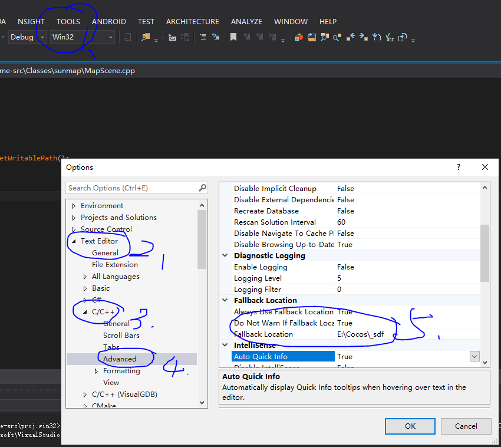

# skyheroes
a pratice project, cocos2d-x lua,  some function intergate got form git, some is tinygame,  127,125,sunmap,throunds heart,pb,net,SpriteWithHue etc.
 
1、use the clean outdir, please don't clone this to the root dir,clone to the second level, like:D:/cocos/skyheroes 
 
2、some one request the small 127, this is full project.
 
3、the small 127 have some bug, no time to fix.
 
4、the best effect is use the vs best ver 2013
 
5、the dir rad is unprocess grabage.
 
6、to build, open the solution, unload the folowing project
1、openssl
2、fcollada
3、libwebsockets
4、spidermonkey
 

7、the large file setting
 

    

 

8、the entrance
 
Please attention the shortcut skyheroes.exe setting is like the folowing...,the params -workdir & -scale is mine, change it to youself.
 
E:\Cocos\projects\skyheroes\simulator\Win32.Debug\skyheroes.exe -workdir "E:\Cocos\projects\skyheroes" -scale 0.8
 
9、VS 2013 & some soft download  
链接：https://pan.baidu.com/s/1oRTlsqrw-U7eluPhpnqeOg 
提取码：abcd 
 

    

 

    

 

    

 

    

 
donate me.

wechat 

 

alipay 

 
 

i am seeking a good team to join. if you are insterest, you mail to me:
 mail:12092020@qq.com
