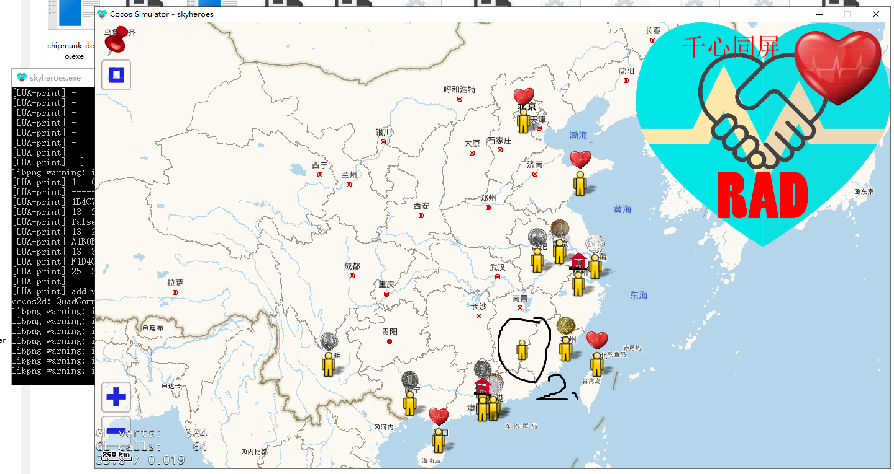

# skyheroes
a pratice project, cocos2d-x lua,  some function intergate got form git, some is tinygame,  127,125,sunmap,throunds heart on one screen,net,SpriteWithHue etc.

1、use the clean outdir, please don't clone this to the root dir,clone to the second level, like:D:/cocos/skyheroes 
2、the tiny 127 have some bug, no time to fix.
3、some one request the tiny 127, this is full project.
4、the best effect is use the vs best ver 2013
5、the dir rad is unprocess grabage.

4、the entrance

    

    

    

    

